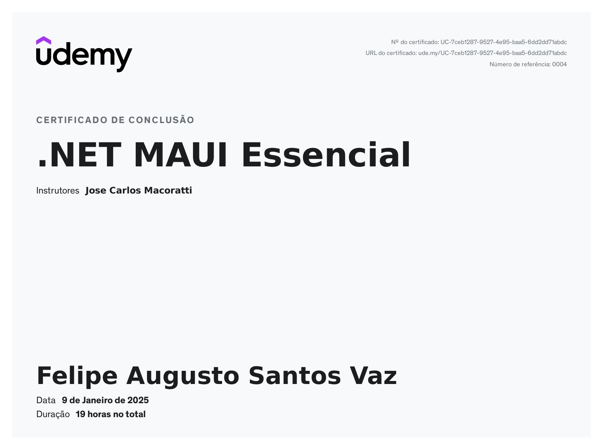

# Curso de .NET MAUI - OOLanches

Este é um aplicativo de venda de lanches desenvolvido com .NET MAUI, projetado para ajudar os os pequenos negócios a vender seus lanches de forma simples e eficiente.

## Objetivo

Este projeto foi desenvolvido para **bases de estudo** e prática em desenvolvimento de aplicativos multiplataforma com .NET MAUI. Ele serve como exemplo de aplicativo para venda de lanches.

## Tecnologias Utilizadas

- **.NET 8**: Versão mais recente do .NET, oferecendo melhor desempenho e novos recursos.
- **.NET MAUI**: Framework para desenvolvimento de aplicativos multiplataforma.
- **SQLite**: Banco de dados leve e local.

## Certificado

